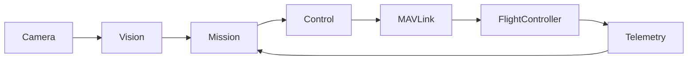

# SAURO UAV — Drone Software

This repository contains the **rotary-wing UAV flight software** developed by the SAURO team, including mission logic, perception (vision) modules, and simulation integrations.

---

## 📁 Project Structure

Below is the repository structure with **both folders and files**, including a short explanation of **what each item is responsible for**.

```
📁 sauro-iha/
├─ README.md
│  └─ Project overview, architecture, setup, and usage guide
│
├─ .gitignore
│  └─ Excludes virtual environments, logs, temporary and private files
│
├─ requirements.txt
│  └─ Python dependencies (OpenCV, pymavlink, etc.)
│
├─ 📁 src/
│  ├─ main.py
│  │  └─ Application entry point (startup sequence, config loading)
│  │
│  ├─ 📁 mission/
│  │  ├─ state_machine.py
│  │  │  └─ Mission FSM (INIT, TAKEOFF, SEARCH, LAND, FAILSAFE)
│  │  └─ mission_manager.py
│  │     └─ High-level mission orchestration logic
│  │
│  ├─ 📁 perception/
│  │  ├─ camera.py
│  │  │  └─ Camera or simulation image source handling
│  │  └─ vision_pipeline.py
│  │     └─ OpenCV-based detection and tracking algorithms
│  │
│  ├─ 📁 control/
│  │  └─ navigation.py
│  │     └─ Converts mission decisions into flight setpoints
│  │
│  ├─ 📁 comms/
│  │  └─ mavlink_client.py
│  │     └─ MAVLink connection, telemetry, and command handling
│  │
│  └─ 📁 utils/
│     ├─ logger.py
│     │  └─ Centralized logging configuration
│     └─ timers.py
│        └─ Timeout and time-based helper utilities
│
├─ 📁 config/
│  ├─ default.yaml
│  │  └─ Common and safe default configuration values
│  ├─ sitl.yaml
│  │  └─ Parameters specific to simulation (SITL)
│  └─ hardware.yaml
│     └─ Configuration for real UAV hardware
│
├─ 📁 scripts/
│  ├─ run_sim.sh
│  │  └─ Script to start SITL + drone software
│  └─ run_uav.sh
│     └─ Script to start real-flight mode
│
└─ 📁 docs/
   ├─ 📁 design/
   │  └─ Architecture.md
   │     └─ Software architecture and design decisions
   │
   └─ 📁 tmp/
      └─ (gitignored) – personal notes / temporary files
```

---

## 🧠 Architecture Overview (Mermaid)

The diagram below illustrates the **high-level data and control flow** of the system:



### Explanation

- Camera images are processed in the **Perception** layer
- Perception outputs and telemetry are evaluated by the **Mission (FSM)** layer
- Decisions are converted into flight commands by **Control**
- Commands are sent to the Flight Controller via **MAVLink**
- Telemetry continuously feeds back into the system

---

## 📌 Design Notes

- Mission logic is built around a **Finite State Machine (FSM)**
- Vision, Mission, and Communication layers are **loosely coupled**
- The same architecture is used for **simulation and real flights**
- All critical parameters are managed via the `config/` directory

---

## 📄 License

Apache-2.0
